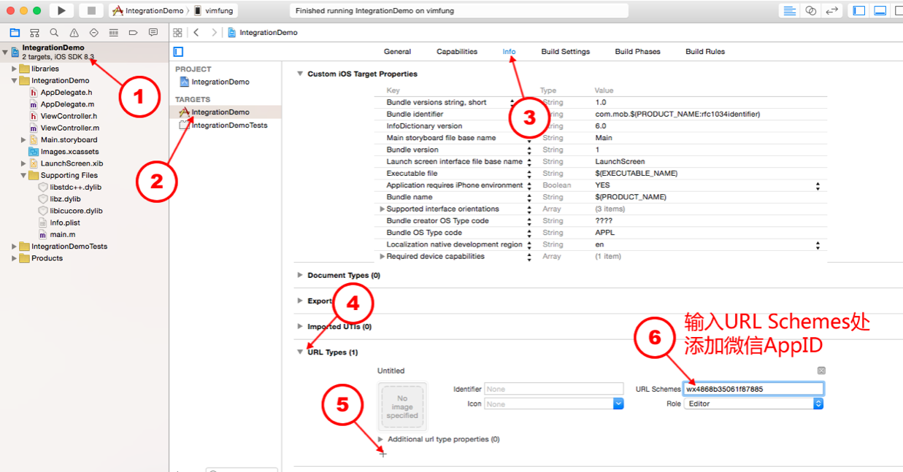
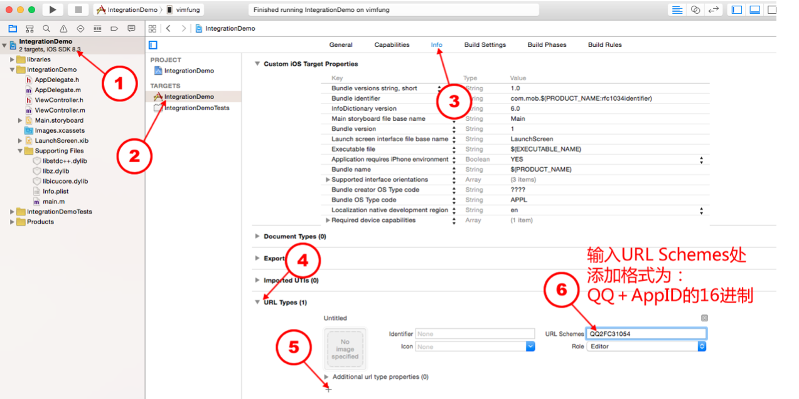
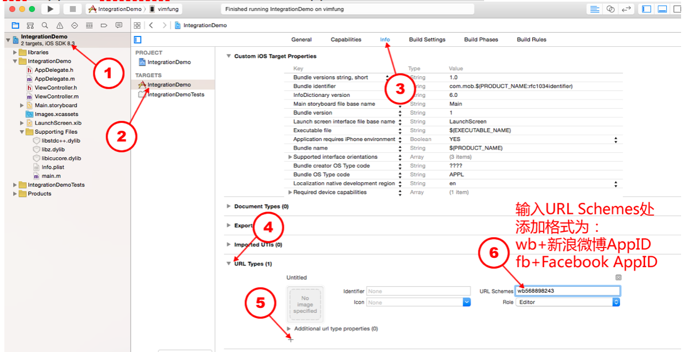
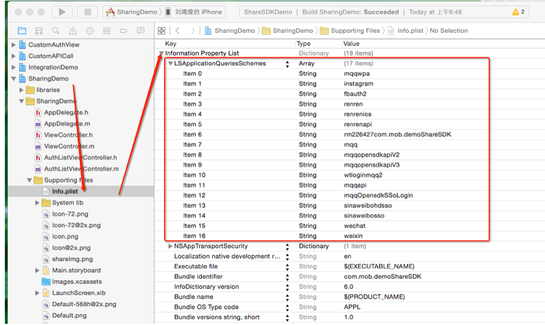

# MEIShareKit
MEIShareKit是移动中台项目iOS端实现分享功能的基础组件，目前已实现QQ，微信，微博三个平台的分享，后续会根据需求反馈集成其他平台以及扩展已有平台下新的分享功能。
### 准备工作
1. CocoaPods

    本组件通过[CocoaPods](https://cocoapods.org)集成，集成前需要先安装CocoaPods。

2. 获取App Key

    QQ、微信、微博三个平台的App Key可以在以下地址进行申请：
    * [腾讯开放平台](http://open.qq.com/)
    * [微信开放平台](https://open.weixin.qq.com/)
    * [微博开放平台](https://open.weibo.com/)

### 开始安装
1. 创建Podfile

    打开终端，cd到需要集成组件的工程项目主目录下，键入`pod init`创建Podfile文件。

2. 编辑Podfile

    ```ruby
    # 添加MEIShareKit配置文件仓库源
    source 'http://10.25.81.246/IOS/cocoapods-specs-private-ios.git'
    platform :ios, 10.0
    use_frameworks!

    target 'YOUR_PROJECT_TARGET' do
        pod 'MEIShareKit'
    end
    ```

3. 安装

    ```ruby
    pod install
    ```

### 配置工程

1. 设置回调URL

    

    

    

2. 添加Scheme白名单

    

    平台|白名单说明|
    ---|---
    微信|wechat，weixin
    微博|sinaweibo，sinaweibohd，sinaweibosso，sinaweibohdsso，weibosdk，weibosdk2.5
    QQ|mqqOpensdkSSoLogin，mqqopensdkapiV2，mqqopensdkapiV3，wtloginmqq2，mqq，mqqapi，timapi
    QQ空间|mqzoneopensdk，mqzoneopensdkapi，mqzoneopensdkapi19，mqzoneopensdkapiV2，mqqOpensdkSSoLogin，mqqopensdkapiV2，mqqopensdkapiV3，wtloginmqq2，mqqapi，mqqwpa，mqzone，mqq，mqqopensdkapiV4

    > 注：若同时使用QQ和QQ空间，则直接添加QQ空间一格即可

### 开始使用

1. 注册对应平台&处理回调URL

    在这一步，我们需要将先前在各开放平台申请的App Key进行注册，并处理回调URL，代码如下：

    ```swift
    import UIKit
    import MEIShareKit

    @UIApplicationMain
    class AppDelegate: UIResponder, UIApplicationDelegate {

        var window: UIWindow?

        func application(_ application: UIApplication, didFinishLaunchingWithOptions launchOptions: [UIApplication.LaunchOptionsKey: Any]?) -> Bool {
            // 如果不分享到小程序，APPLET_KEY可以为空
            ShareManager.register(key: WECHAT_KEY, appletKey: APPLET_KEY, on: .WeChat(scene: nil))
            ShareManager.register(key: QQ_KEY, appletKey: nil, on: .QQ(scene: nil))
            ShareManager.register(key: WEIBO_KEY, appletKey: nil, on: .Weibo)
            return true
        }

        func application(_ app: UIApplication, open url: URL, options: [UIApplication.OpenURLOptionsKey : Any] = [:]) -> Bool {
            return ShareManager.handle(url: url)
        }

    }
    ```

2. 分享内容到平台

    本组件包含两种使用模式，分为菜单分享和直接分享(**建议**)两种。
    ```swift
    // 以下为菜单分享模式，需要传入[ShareScene]
    var shareItem = ShareItem()
    shareItem.title = "分享标题"
    shareItem.desc = "分享内容"
    shareItem.link = "https://www.baidu.com"
    shareItem.image  = SHARE_IMAGE

    let result =  { (succeed: Bool, message: String) in
        if succeed {
            print("分享成功")
        } else {
            print("分享失败")
        }
    }

    let scenes = [ShareScene(image: WECHAT_IMAGE, title: "微信", platform: .WeChat(scene: .Session)),
                  ShareScene(image: TIMELINE_IMAGE, title: "朋友圈", platform: .WeChat(scene: .Timeline)),
                  ShareScene(image: QQ_IMAGE, title: "QQ", platform:.QQ(scene: .Friends)),
                  ShareScene(image: QZONE_IMAGE, title: "QQ空间", platform: .QQ(scene: .QZone)),
                  ShareScene(image: WEIBO_IMAGE, title: "微博", platform: .Weibo)]

    ShareManager.setup(with: shareItem, result)
    ShareManager.show(in: TARGET_VIEW, scenes: scenes)
    ```

    ```swift
    // 以下为直接分享模式
    var shareItem = ShareItem()
    shareItem.title = "分享标题"
    shareItem.desc = "分享内容"
    shareItem.link = "https://www.baidu.com"
    shareItem.image  = SHARE_IMAGE

    let result =  { (succeed: Bool, message: String) in
        if succeed {
            print("分享成功")
        } else {
            print("分享失败")
        }
    }

    // 分享到微信会话
    ShareManager.share(shareItem, on: .WeChat(scene: .Session), result)
    // 分享到微信朋友圈
    ShareManager.share(shareItem, on: .WeChat(scene: .Timeline), result)
    // 分享到QQ好友
    ShareManager.share(shareItem, on: .QQ(scene: .Friends), result)
    // 分享到QQ空间
    ShareManager.share(shareItem, on: .QQ(scene: .QZone), result)
    // 分享到微博
    ShareManager.share(shareItem, on: .Weibo, result)
    ```

### 分享规则与限制

1. 微博分享规则

    支持类型及参数：
    * 文字(title)
    * 图片(title+image)
    * 链接(title+desc+link+thumbnail)

    参数说明：
    * title：不能超过140个汉字
    * image：图片最大不超过5M，仅支持JPEG、GIF、PNG格式

    > 注意：文字+图片是不会显示图片的，只会显示文字；链接分享不会显示图片，如果既要必须要文字图片都带的话，需要把链接拼接在title后面分享才行。另外微博不支持分享动态图。

2. QQ好友分享规则

    支持类型及参数：
    * 文字(title)
    * 图片(title+desc+image+thumbnail，网络和本地的GIF图片也支持)
    * 链接(title+desc+link+thumbnail)

    参数说明：
    * desc：最多40个字符
    * title：最多30个字符，超出部分会被截断
    * link ：URL 地址，最长 512 个字符
    * thumbnail：预览图数据，最大1M字节
    * image：最大5M字节

3. QQ空间分享规则

    支持类型及参数：
    * 文字(title)
    * 图片(title+desc+image+thumbnail，网络和本地的GIF图片也支持)
    * 链接(title+desc+link+thumbnail)

    参数说明：
    * link: 必须用域名网址
    * title：最多200个字符
    * desc：最多600个字符

4. 微信分享规则

    会话支持类型及参数：
    * 文字(title)
    * 图片(title+image+thumbnail)
    * 链接(title+desc+link+thumbnail)
    * 音乐链接(title+desc+link+mediaDataURL+thumbnail+multimediaType=.Audio)
    * 视频链接(title+desc+link+thumbnail+multimediaType=.Video)
    * 应用消息(title+desc+link+image+thumbnail+extInfo+multimediaType=.App)
    * GIF(file+thumbnail，仅支持本地文件)
    * 文件(title+desc+file+fileExt+thumbnail+multimediaType=.File)
    * 小程序(title+link+image+thumbnail+path+shareTicket+appletType+multimediaType=.Applet)

    朋友圈支持类型及参数：
    * 文字(同会话参数)
    * 图片(同会话参数)
    * 链接(同会话参数)
    * 音乐链接(同会话参数)
    * 视频链接(同会话参数)

    参数说明：
    * title：512Bytes以内
    * desc：1KB以内
    * image：大小不能超过10M(支持JPG、PNG格式，较好的效果为大图360*200，小图200*200 )
    * thumbnail：内存大小不能超过32K的png图
    * link：不能为空且长度不能超过10K
